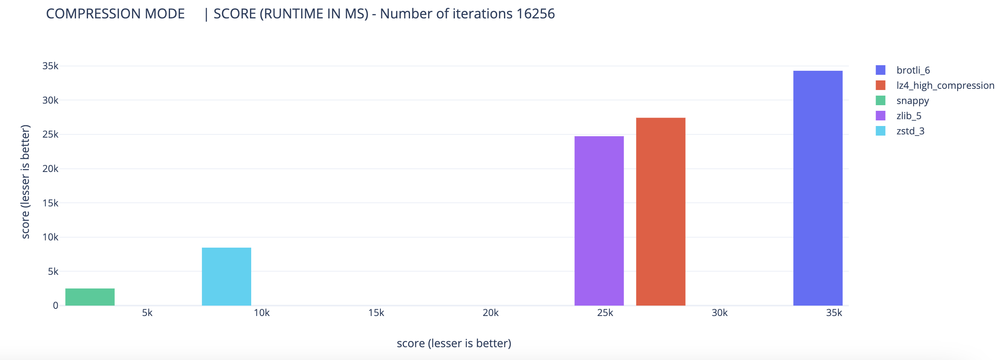
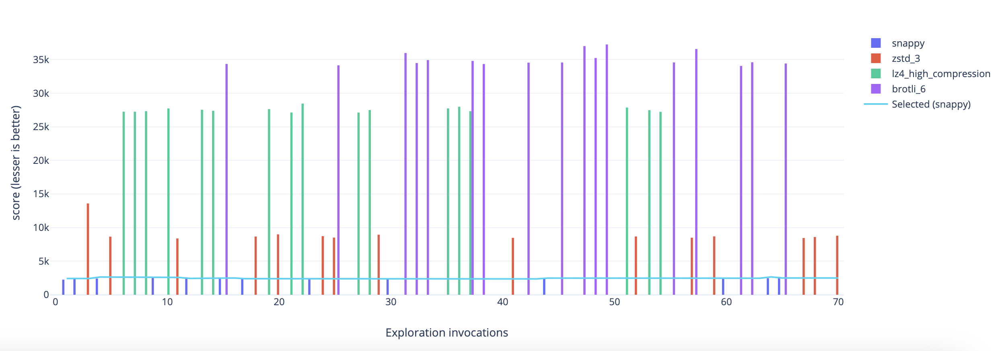

## Exploit-Explore

Implementation of `Exploit-Explore` algorithm. Implementation itself and 
supportive code (variant definition, simple hashing of variant) is located in `/explore` folder.

The main idea behind the `Exploit-Explore` algorithm is to dynamically identify the best option for exploitation based on a reasonable number of exploration attempts in order to search for the optimal score.

This algorithm balances the exploration of different options with the exploitation of the currently known best option. By initially exploring various choices, it gathers information about their performance and refines its understanding of which options are most promising. As more data is collected, the algorithm gradually shifts towards exploiting the option that appears to be the best based on the accumulated knowledge.

The `Exploit-Explore` algorithm is particularly useful in scenarios where the optimal choice may change over time or where the performance of different options is uncertain.

As benchmark, I used compression algorithms (brotly, lz, snappy, zlib, zstd) to find best one
based on dynamic calculation of score. Please see explanation section for more details below.

### Build and Run

```BASH
go run explore
```

### Explanation

`Exploit-Explore` algorithm is one of the implementation of `Bandit Algorithm`. Let's write up principles of that
algorithm family below:
- choose arm
- get score
- memorize arm and score for next exploitation

`Exploit-Explore` algorithm practical explanation on the principles above could be described as:
- with some probability, which is determined by the remainder of dividing a compile-time constant by `256`, it is matched with a dynamic variable representing the probability threshold
- based on that, program going to exploration or exploitation mode
```go
if float64(currentCount%ProbabilityDistributionBuckets) < ExplorationProbabilityThreshold {
		// Exploitation mode.
	inExploitationMode(selectedVariant, variantsWithStat, config)
} else {
	// Exploration mode.
	selectedVariant, exploredVariant = inExplorationMode(variantsWithStat, selectedVariant, config)
}
```
- if exploitation mode (more probability to call, please see statistics in `Results` section), program gets selected variant function pointer and calls function.
- if exploration mode, program counts simple hash (used `murmur` finalizer to make hash), getting some variant and calls it. 
Then counts score (time of execution in the simplest case) based on retrieved results.
- Then based on the statistics from exploration, program replaces pointer to most efficient function calculating optimal score

### Results
After running `expore` program with default arguments you suppose to see following output in your terminal:

```
Compressing file "test/book1" using [brotli_6 lz4_high_compression snappy zlib_5 zstd_3] codecs 16256 times #                 ...  ???  [.........<#>...........] [1.20K iterations]

+-------------------+-------+
| MODE              | COUNT |
+-------------------+-------+
| Exploitation mode | 16181 |
| Exploration mode  |    75 |
+-------------------+-------+
Number of iterations 16256

+----------------------+-----------------------+
| COMPRESSION MODE     | SCORE (RUNTIME IN ΜS) |
+----------------------+-----------------------+
| brotli_6             |                 34290 |
| lz4_high_compression |                 27426 |
| snappy               |                  2500 |
| zlib_5               |                 24736 |
| zstd_3               |                  8463 |
+----------------------+-----------------------+
```
_As plot for better visibility:_



```
+------------------+-----------------------+----------------------+-----------------+
| SELECTED (BEST)  | SELECTED (BEST) SCORE | EXPLORED             |  EXPLORED SCORE |
| COMPRESSION MODE |       (RUNTIME IN ΜS) | COMPRESSION MODE     | (RUNTIME IN ΜS) |
+------------------+-----------------------+----------------------+-----------------+
| zstd_3           |                 13590 | zstd_3               |      1000000000 |
| zstd_3           |                 13590 | lz4_high_compression |      1000000000 |
| snappy           |                  2253 | snappy               |      1000000000 |
| snappy           |                  2253 | brotli_6             |      1000000000 |
| snappy           |                  2424 | snappy               |            2253 |
| snappy           |                  2415 | snappy               |            2424 |
| snappy           |                  2415 | zstd_3               |           13590 |
| snappy           |                  2643 | snappy               |            2415 |
| snappy           |                  2643 | zstd_3               |            8652 |
| snappy           |                  2643 | lz4_high_compression |           27254 |
| snappy           |                  2643 | lz4_high_compression |           27250 |
| snappy           |                  2643 | lz4_high_compression |           27331 |
| snappy           |                  2590 | snappy               |            2643 |
| snappy           |                  2590 | lz4_high_compression |           27732 |
| snappy           |                  2590 | zstd_3               |            8384 |
| snappy           |                  2430 | snappy               |            2590 |
| snappy           |                  2430 | lz4_high_compression |           27535 |
| snappy           |                  2430 | lz4_high_compression |           27388 |
| snappy           |                  2491 | snappy               |            2430 |
| snappy           |                  2491 | brotli_6             |           34356 |
| snappy           |                  2389 | snappy               |            2491 |
| snappy           |                  2389 | zstd_3               |            8665 |
| snappy           |                  2389 | lz4_high_compression |           27637 |
| snappy           |                  2389 | zstd_3               |            8993 |
| snappy           |                  2389 | lz4_high_compression |           27132 |
| snappy           |                  2389 | lz4_high_compression |           28454 |
| snappy           |                  2428 | snappy               |            2389 |
| snappy           |                  2428 | zstd_3               |            8729 |
| snappy           |                  2428 | zstd_3               |            8514 |
| snappy           |                  2428 | brotli_6             |           34152 |
| snappy           |                  2428 | lz4_high_compression |           27122 |
| snappy           |                  2428 | lz4_high_compression |           27494 |
| snappy           |                  2428 | zlib_5               |      1000000000 |
| snappy           |                  2428 | zstd_3               |            8946 |
| snappy           |                  2362 | snappy               |            2428 |
| snappy           |                  2362 | zlib_5               |           24570 |
| snappy           |                  2362 | brotli_6             |           35980 |
| snappy           |                  2362 | brotli_6             |           34498 |
| snappy           |                  2362 | brotli_6             |           34930 |
| snappy           |                  2362 | lz4_high_compression |           27741 |
| snappy           |                  2362 | lz4_high_compression |           27988 |
| snappy           |                  2362 | lz4_high_compression |           27331 |
| snappy           |                  2362 | brotli_6             |           34812 |
| snappy           |                  2362 | brotli_6             |           34346 |
| snappy           |                  2362 | zlib_5               |           24936 |
| snappy           |                  2362 | zstd_3               |            8476 |
| snappy           |                  2362 | zlib_5               |           25501 |
| snappy           |                  2362 | brotli_6             |           34545 |
| snappy           |                  2480 | snappy               |            2362 |
| snappy           |                  2480 | zlib_5               |           24768 |
| snappy           |                  2480 | brotli_6             |           34574 |
| snappy           |                  2480 | zlib_5               |           25060 |
| snappy           |                  2480 | brotli_6             |           37012 |
| snappy           |                  2480 | brotli_6             |           35243 |
| snappy           |                  2480 | brotli_6             |           37252 |
| snappy           |                  2480 | lz4_high_compression |           27868 |
| snappy           |                  2480 | zstd_3               |            8678 |
| snappy           |                  2480 | lz4_high_compression |           27483 |
| snappy           |                  2480 | lz4_high_compression |           27230 |
| snappy           |                  2480 | zlib_5               |           25429 |
| snappy           |                  2480 | brotli_6             |           34582 |
| snappy           |                  2480 | zstd_3               |            8503 |
| snappy           |                  2480 | brotli_6             |           36577 |
| snappy           |                  2480 | zstd_3               |            8693 |
| snappy           |                  2462 | snappy               |            2480 |
| snappy           |                  2462 | zlib_5               |           24855 |
| snappy           |                  2462 | brotli_6             |           34064 |
| snappy           |                  2462 | brotli_6             |           34607 |
| snappy           |                  2655 | snappy               |            2462 |
| snappy           |                  2500 | snappy               |            2655 |
| snappy           |                  2500 | brotli_6             |           34422 |
| snappy           |                  2500 | zstd_3               |            8450 |
| snappy           |                  2500 | zstd_3               |            8598 |
| snappy           |                  2500 | zlib_5               |           24432 |
| snappy           |                  2500 | zstd_3               |            8791 |
+------------------+-----------------------+----------------------+-----------------+
```
_As plot for better visibility:_



### Testing
Please look into `config/config.go` to observe all options to start program. You can apply following flags:

- `c` - Number of operations per each defined codec/file. Default value - 16256
- `s` - Score type: 0 - Runtime, 1 - Compress factor. Default value - 0
- `d` - Define codecs. Options - snappy, lz4, lz4_high_compression, brotli_1, brotli_2, brotli_3, brotli_4, brotli_5, brotli_6, brotli_7,
		brotli_8, brotli_9, brotli_10, brotli_11, zlib_1, zlib_2, zlib_3, zlib_4, zlib_5, zlib_6, zlib_7, zlib_8,
		zlib_9, zstd_1, zstd_3, zstd_7. Default value - brotli_6 lz4_high_compression snappy
- `f` - File path to test score (Runtime / Compress factor. Default - [test/book1] in the root of source code folder

You can test with different files from attached `tests` folder. That's `The Calgary Corpus` from here - https://corpus.canterbury.ac.nz/descriptions/ 

### TODO
* No unit tests, that's just POC
* No support of branchless implementation in 
```go
if float64(currentCount%ProbabilityDistributionBuckets) < ExplorationProbabilityThreshold {
		// Exploitation mode.
		inExploitationMode(selectedVariant, variantsWithStat, config)
} else {
    // Exploration mode.
    selectedVariant, exploredVariant = inExplorationMode(variantsWithStat, selectedVariant, config)
}
```
since in most of the cases algorithm visiting exploitation mode there are should be implementation 
of branchless strategy same way as C++ doing `[[likely]]` compiler directive
* Time score calculated as
```go
elapsed := time.Since(start)
```
what gives very rough precision in case of calculating very fast functions. 
Must use `rsdtsc` for x86/x64 (look this package here - https://github.com/dterei/gotsc as starting point) or
`cntvct_el0` for arm64 M1/M2 (discussion is here - https://stackoverflow.com/questions/40454157/is-there-an-equivalent-instruction-to-rdtsc-in-arm) 
* Won't work for very small/fast functions very well. You need bottom border of function execution from 300ns to collect statistics correctly
* No protection from `context switch` or `page fault`, in production-ready code the score from that function must be ignored

### License
MIT - https://github.com/git/git-scm.com/blob/main/MIT-LICENSE.txt
